<p align="center">
  <a href="https://datamine.purdue.edu"></a>
</p>

# Deploying Python Applications to Geddes via Kubernetes
Contact Justin Gould (gould29@purdue.edu) for more information.

# Getting Started
## What is Kubernetes?
To explain what Kubernetes is, I will reference [language used by the developers of Kubernetes](https://kubernetes.io/docs/concepts/overview/what-is-kubernetes/)...

Kubernetes, also known as K8s, is an open-source system for automating deployment, scaling, and management of containerized applications.. It groups containers that make up an application into logical units for easy management and discovery. Kubernetes builds upon 15 years of experience of running production workloads at Google, combined with best-of-breed ideas and practices from the community.

Let's take a look at why Kubernetes is so useful by going back in time.


**Traditional deployment era:** Early on, organizations ran applications on physical servers. There was no way to define resource boundaries for applications in a physical server, and this caused resource allocation issues. For example, if multiple applications run on a physical server, there can be instances where one application would take up most of the resources, and as a result, the other applications would underperform. A solution for this would be to run each application on a different physical server. But this did not scale as resources were underutilized, and it was expensive for organizations to maintain many physical servers.

**Virtualized deployment era:** As a solution, virtualization was introduced. It allows you to run multiple Virtual Machines (VMs) on a single physical server's CPU. Virtualization allows applications to be isolated between VMs and provides a level of security as the information of one application cannot be freely accessed by another application.

Virtualization allows better utilization of resources in a physical server and allows better scalability because an application can be added or updated easily, reduces hardware costs, and much more. With virtualization you can present a set of physical resources as a cluster of disposable virtual machines.

Each VM is a full machine running all the components, including its own operating system, on top of the virtualized hardware.

**Container deployment era:** Containers are similar to VMs, but they have relaxed isolation properties to share the Operating System (OS) among the applications. Therefore, containers are considered lightweight. Similar to a VM, a container has its own filesystem, share of CPU, memory, process space, and more. As they are decoupled from the underlying infrastructure, they are portable across clouds and OS distributions.

Containers have become popular because they provide extra benefits, such as:
- Agile application creation and deployment: increased ease and efficiency of container image creation compared to VM image use.
- Continuous development, integration, and deployment: provides for reliable and frequent container image build and deployment with quick and efficient rollbacks (due to image immutability).
- Dev and Ops separation of concerns: create application container images at build/release time rather than deployment time, thereby decoupling applications from infrastructure.
- Observability not only surfaces OS-level information and metrics, but also application health and other signals.
- Environmental consistency across development, testing, and production: Runs the same on a laptop as it does in the cloud.
- Cloud and OS distribution portability: Runs on Ubuntu, RHEL, CoreOS, on-premises, on major public clouds, and anywhere else.
- Application-centric management: Raises the level of abstraction from running an OS on virtual hardware to running an application on an OS using logical resources.
- Loosely coupled, distributed, elastic, liberated micro-services: applications are broken into smaller, independent pieces and can be deployed and managed dynamically – not a monolithic stack running on one big single-purpose machine.
- Resource isolation: predictable application performance.
- Resource utilization: high efficiency and density.

Containers are a good way to bundle and run your applications. In a production environment, you need to manage the containers that run the applications and ensure that there is no downtime. For example, if a container goes down, another container needs to start. Wouldn't it be easier if this behavior was handled by a system?

That's how Kubernetes comes to the rescue! Kubernetes provides you with a framework to run distributed systems resiliently. It takes care of scaling and failover for your application, provides deployment patterns, and more. For example, Kubernetes can easily manage a canary deployment for your system.

Kubernetes provides you with:
- Service discovery and load balancing Kubernetes can expose a container using the DNS name or using their own IP address. If traffic to a container is high, Kubernetes is able to load balance and distribute the network traffic so that the deployment is stable.
- Storage orchestration Kubernetes allows you to automatically mount a storage system of your choice, such as local storages, public cloud providers, and more.
- Automated rollouts and rollbacks You can describe the desired state for your deployed containers using Kubernetes, and it can change the actual state to the desired state at a controlled rate. For example, you can automate Kubernetes to create new containers for your deployment, remove existing containers and adopt all their resources to the new container.
- Automatic bin packing You provide Kubernetes with a cluster of nodes that it can use to run containerized tasks. You tell Kubernetes how much CPU and memory (RAM) each container needs. Kubernetes can fit containers onto your nodes to make the best use of your resources.
- Self-healing Kubernetes restarts containers that fail, replaces containers, kills containers that don't respond to your user-defined health check, and doesn't advertise them to clients until they are ready to serve.
- Secret and configuration management Kubernetes lets you store and manage sensitive information, such as passwords, OAuth tokens, and SSH keys. You can deploy and update secrets and application configuration without rebuilding your container images, and without exposing secrets in your stack configuration.

## Kubernetes Architecture and Components
When you deploy Kubernetes, you get a cluster.

A Kubernetes cluster consists of a set of worker machines, called nodes, that run containerized applications. Every cluster has at least one worker node.

The worker node(s) host the Pods that are the components of the application workload. The control plane manages the worker nodes and the Pods in the cluster. In production environments, the control plane usually runs across multiple computers and a cluster usually runs multiple nodes, providing fault-tolerance and high availability.

This document outlines the various components you need to have a complete and working Kubernetes cluster.

Here's the diagram of a Kubernetes cluster with all the components tied together.


# Deploying your First Python Application on Geddes via Kubernetes
Overview:

_Prerequisite Steps_

1. Install necessary software on your computer
2. Request access to Geddes from ITaP

_Application-specific Steps_

3. Configure local Kubernetes config, based off Geddes config
4. Locally develop and test Docker image
5. Create a project or namespace on `geddes-registry`, or find an existing one to contribute to
6. Tag and push local Docker image to `geddes-registry` project or namespace
7. Create a project or namespace on Rancher, or find an existing one to contribute to, and deploy application
    - Add your registry to a project or namespace on Rancher
    - Add robot account to Rancher
    - Use registry in a deployment on Rancher

## Install Necessary Software on your Computer

Before deploying to Kubernetes on Geddes, you need to install and set up the following on your local machine:

- Docker
  - https://www.docker.com/products/docker-desktop
  - Once downloaded and installed, be sure to start docker and verify it is installed correctly by opening a terminal on Mac and Linux and running the command `docker` (on Windows, you will need a UNIX shell, so open PowerShell). You should see helpful information on commands, etc.
- Kubernetes
  - http://kubernetes.io/docs/user-guide/prereqs/
  - By walking through the above guide, you will install and set up Kubernetes for your local computing environment

## Request access to Geddes from ITaP

Access to Geddes can be requested via a ticket to rcac-help@purdue.edu. 

## Configure Local Kubernetes

Once you have access to Geddes, [connect to Purdue's VPN](https://www.itap.purdue.edu/connections/vpn/), if off campus, and log on to Rancher at https://beta.geddes.rcac.purdue.edu/login.

You should see this upon authentication:


Click on the `geddes` cluster:


Find the "Kubeconfig File" button in the upper right, which will pull up this pop-up window:
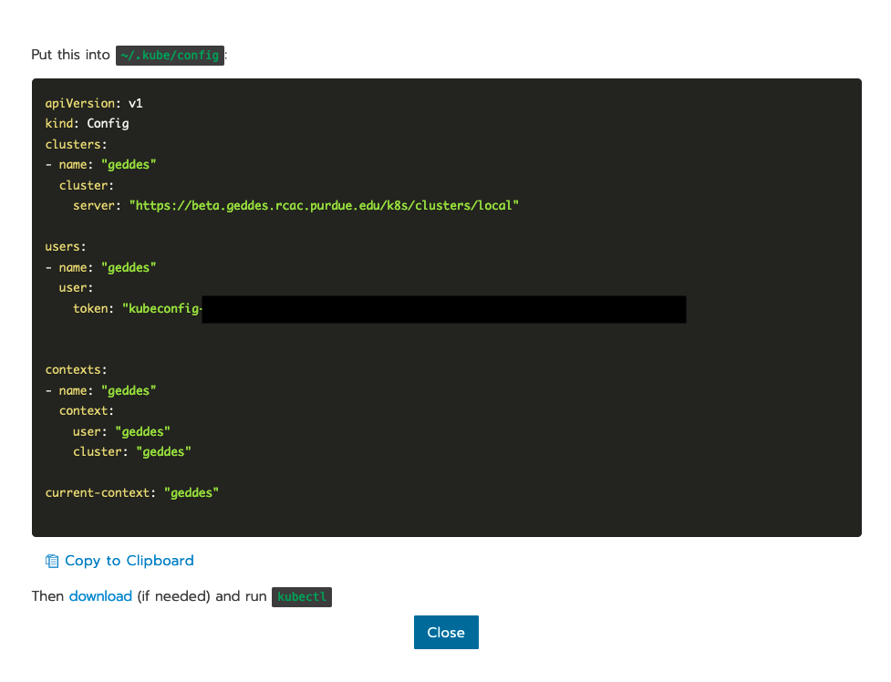

Copy this configuration to your clipboard and head to a terminal on your local machine. Likely, Kubernetes's home directory (`~/.kube/`) will not exist, if you just installed Kubernetes for the first time. If this is the case, in your terminal, run the following to create the directory and the config:

```bash
mkdir ~/.kube
cd ~/.kube
vim config
```

When inside `config`, paste what's in your clipboard and save and quit (`:wq`).

This will ensure your local machine is configured for Geddes.

# Locally Develop and Test Docker Image
But first, some context...

In this repository, there is a Dockerfile (`Dockerfile`), as well as Python code (`app.py` is a Flask application, with a REST API, as well as `.src/fun.py`, which is the function referenced by the Flask application's endpoint `add_two`). The function takes an number as input and returns the sum of 2 and the input number (e.g., `5` returns `7`, `12` returns `14`, etc.).

Thus, the goal of our Flask app and our K8s container is, when you send an HTTP request to `add_two`, your response is the sum of 2 and your input. We want this deployed within Purdue's HPC infrastructure, callable when connected to our VPN. You can see how this works in `Demo.ipynb`; it shows the HTTP request to our deployed instance and the response.

Now that we have the context, let's break down [this Dockerfile](https://github.com/TheDataMine/geddes-kubernetes-deployment/blob/main/Dockerfile):

```
#Create a ubuntu base image with python 3 installed.
FROM python:3

#Set the working directory
WORKDIR /workspace

#copy all the files
COPY . .

#Install the dependencies
RUN apt-get -y update
RUN pip3 install flask

#Expose the required port
EXPOSE 5000

#Run the command
CMD ["python3", "app.py"]
```

I start off by establishing a base Python 3 image and then setting the working directory, to which I will copy all files from the directory on my local machine with the Dockerfile (i.e., the GitHub repository contents are copied into `/workspace`). Then, I install all dependencies, including updating packages and installing `flask` for our application. Next, I expose port `5000`, which will host the application. Finally, I execute the command to deploy and run the flask application, which is called `app.py`, at the top of the GitHub repository structure.

Once you have created this Dockerfile, it is time to build and test it. This is done via terminal:
```bash
cd /path/to/your/dockerfile
docker build -t <my-name>/<image-name>:<tag> .
```

For example, for this Dockerfile, on my MacBook, I ran:
```bash
cd /Users/gould29/OneDrive\ -\ purdue.edu/GitHub/geddes-kubernetes-deployment
docker build -t gould29/k8s-demo:latest .
```

To see your images, run `docker images`. When I do this, I see:


Now, it is time to test the Docker image before tagging and pushing to the Harbor Registry. I complete testing by running the following:
```bash
docker run -d -p 5000:5000 gould29/k8s-demo:latest
```

This test will launch the flask application and expose it on port 5000. Upon running this, I can use `docker ps` to my currently-running containers, which shows me:


I then go to my browser and navigate to http://localhost:5000/. This shows:


Great! Our app is running. Now, let's make sure our `add_two` endpoint is working, too. To test this, I use `Demo.ipynb` to execute an HTTP request. See below:


Awesome! Our `add_two` endpoint works as expected. We are now ready to start the process of tagging and pushing this image to the Harbor Registry.

# Create a Project or Namespace on `geddes-registry`

Visit the Harbor Registry: https://geddes-registry.rcac.purdue.edu/harbor/sign-in?redirect_url=%2Fharbor%2Fprojects.

When you sign in, you will see:


Either find an existing project to which you'd like to contribute or create your own. To create your own:

1. From the main page click "new project" this will act as your registry
2. Fill in a name and select whether you want the project to be public/private


Now, click on the new project you created and navigate to "Robot Accounts." Here, you will create a new robot account:


Fill out the form:
- Name your robot account
- Select account expiration if any, select never to make permenant
- Customize what permissions you wish the account to have, here I specify the account is only allowed to pull images
- Click ADD


Copy your information:
- Your robot’s account name will be something longer than what you specified, since this is a multi-tenant registry, harbor does this to avoid unrelated project owners creating a similarly named robot account
- Export your token as a JSON or copy it to a clipboard

**NOTE: Harbor does not store account tokens,  once you exit this page your token will be unrecoverable**


# Tag and Push local Docker Image to `geddes-registry` Project or Namespace

Now that you have identified where on the Harbor Registry to push your Docker image, it is time to tag and push. This is done using thw following steps.

Tag:
```bash
docker tag my-image:tag geddes-registry.rcac.purdue.edu/my-name/my-image:tag
```

Log in to Harbor Registry
```bash
docker login geddes-registry.rcac.purdue.edu
```

Push image
```bash
docker push geddes-registry.rcac.purdue.edu/my-name/my-image:tag 
```

So, in the example of the Docker image I have for this repository:
```bash
docker tag gould29/k8s-demo:latest geddes-registry.rcac.purdue.edu/gould29/gould29/k8s-demo:latest
docker login geddes-registry.rcac.purdue.edu
docker push geddes-registry.rcac.purdue.edu/gould29/gould29/k8s-demo:latest
```

You will then see progress of your imaging pushing to the registry:


When it's done, you will receive a confirmation in your terminal, and you can see it in your project on the Harbor Registry:


# Create a Project or Namespace on Rancher

Navigate to Rancher: https://beta.geddes.rcac.purdue.edu/g/clusters

Then, click on the cluster you'd like to access. In our case, it is the `geddes` cluster, and the `datamine` project:
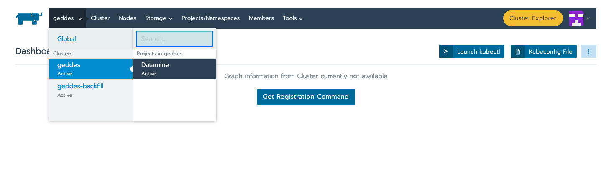

Click on "Namespaces" and "Add Namespace" **if there is not a namespace already created for your project**:
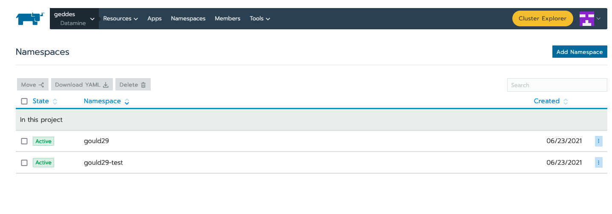

Fill out the name and memory requirements before hitting "Create" at the bottom of the page:
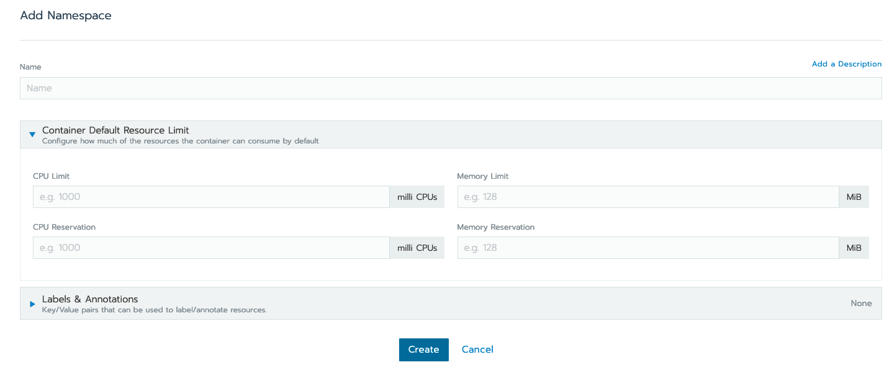

Once you've created a namespace, or found an existing one you'd like to use, you can close out of the namespace screen, and navigate to "Secrets" under "Resources." Rancher needs to know where the registry lives and how to authenticate to that registry in order to pull images. Here we add our robot accounts registry credentials to our project in order for this to work. 
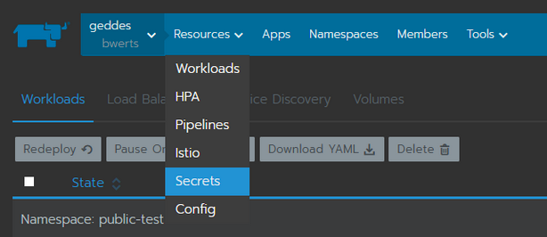

Click on "Registry Credentials"
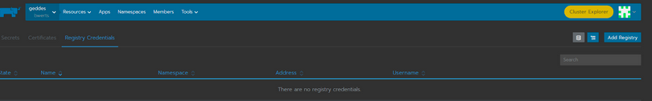

Fill in all fields:
- Give a name to the Registry secret (this is an arbitrary name)
- Select whether or not it’s available to all or a single namespace 
- Select address as “custom” and provide “geddes-registry.rcac.purdue.edu”
- Enter your robot accounts long name as the Username
- Enter your robot accounts token as the Password
- Click “Save”


# Deploy your Application

Now that Rancher has our credentials it can pull any image we are authorized to pull. From the "workloads" section of your project click “deploy” at the top right:

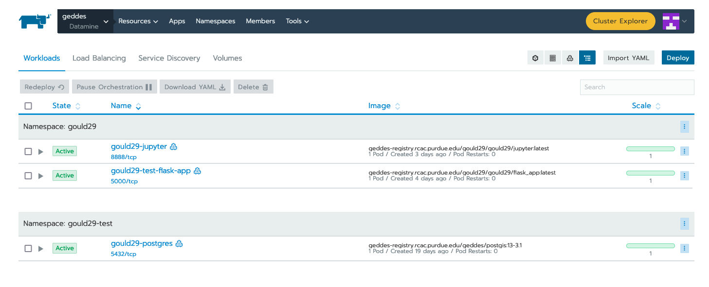

In the “docker image” box specify your image. You will provide the same name you created when tagging the image.

So since I tagged my image as “geddes-registry.rcac.purdue.edu/lab-registry/my-image:tag”
We use that here to pull our image

Configure any additional changes your deployment needs from here and click “launch”:

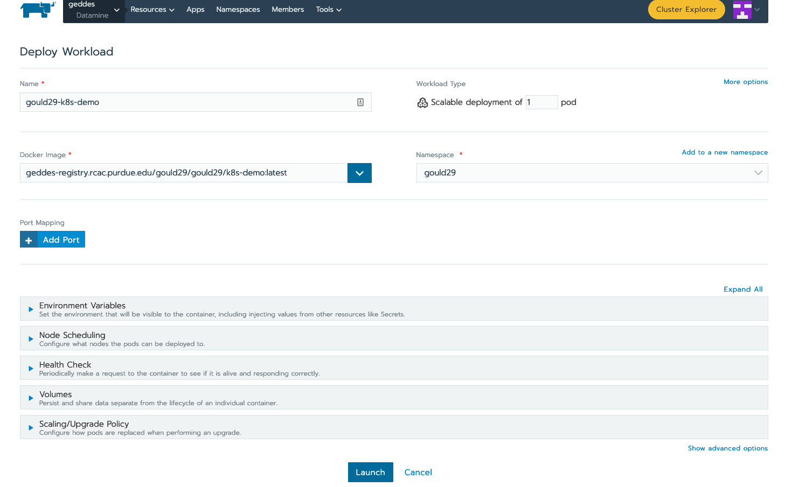

When the application is running, you should be able to see the following status update on the "workloads" page of Rancher. Note that the dashboard shows that our application (`gould29-k8s-demo`) as "active" status:

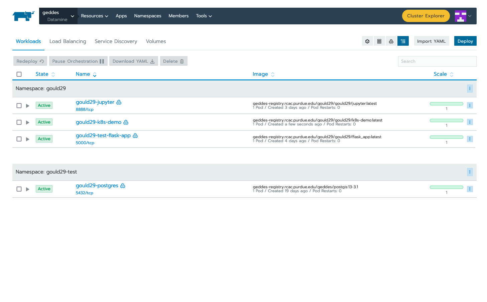

# Create an Endpoint for your Application

Once you have deployed your workload, it is time to associate your application with an endpoint within Purdue. This can be accomplished via the "Service Directory" section of the Rancher application:

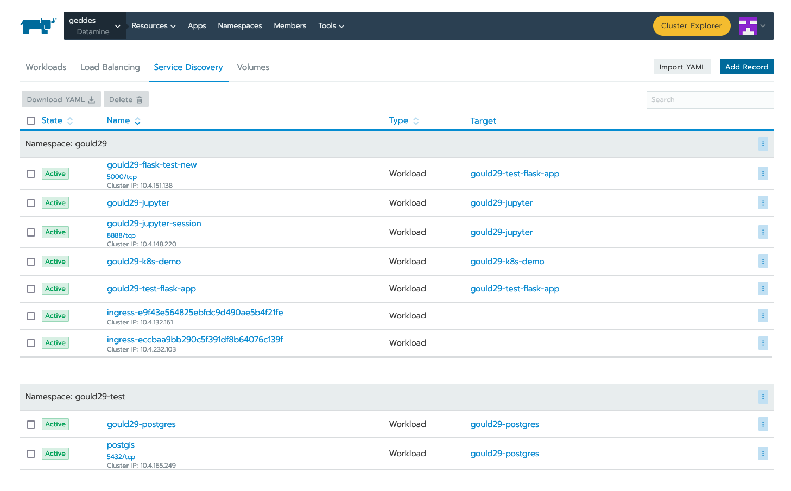

You can see that we have a listing for `gould29-k8s-demo`; however, this item does not have a Cluster IP associated with it. In order to obtain this IP, click "Add Record" in the upper right.

Your applications can be exposed outside of the cluster using kubernetes service load-balancers. These services also auto-generate DNS names for your applications to be reachable from in the format <service-name>.<namespace>.geddes.rcac.purdue.edu

These load-balancer services can expose your applications on two different IP spaces:
  - Campus Private - Services only reachable via Purdue networks
  - Public - Services reachable from anywhere via the public internet

Fill out the top form (do not click create when done with this step):
 - Name your service and select the namespace where your application is deployed.This will act as your new URL mentioned above, so my URL will be “my-name.my-namespace.geddes.rcac.purdue.edu”
 - Select “one or more workloads” under “Resolves To”
 - Click on the new “Add Target Workload” box and select your workload 
 - At the bottom right click “show advanced options”
 - Under “As a” select “layer-4 Load Balancer” you can leave the new option boxes default 

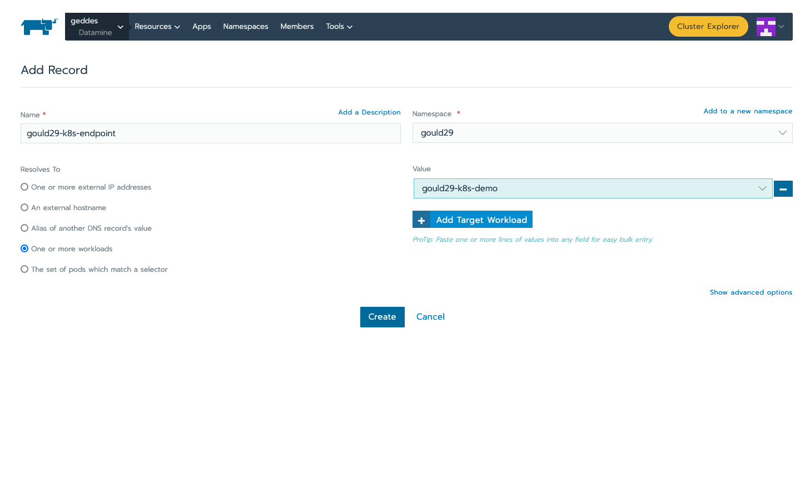

Click “add Port” under “Port Mapping”

Note: in this example I want all connections hitting my load-balancer IP on port (Published service port) 80 to send those connections to my container port (target port) 80 where apache listens.
If my web server was listening on port 8888 and I wanted to reach that web service on standard port 80 your “published service port” would be 80 your “target port” would be 5000
 - Add the port you want to open on the load-balancer side under “Publish The Service Port” 
 - Under “Target Port” add the container port your service listens on.

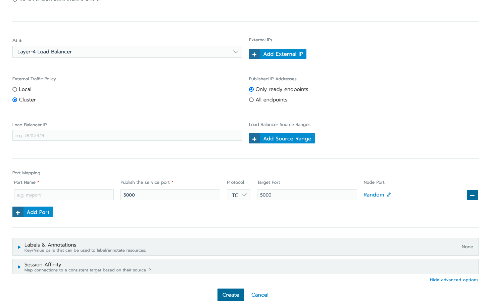

Choose to deploy your workload to Campus IP space or Public IP space:
- Campus IP
  - From here click “Create” as Campus IP space is the default load-balancer option
- Public IP
  - Select the “labels & Annotations” drop down
  - Click the “Add annotation” button
  - Add annotation “metallb.universe.tf/address-pool = geddes-public-pool”
  - Click "Create" when finished


Test the newly created service by clicking the “port/tcp” option under our new service 
resource.

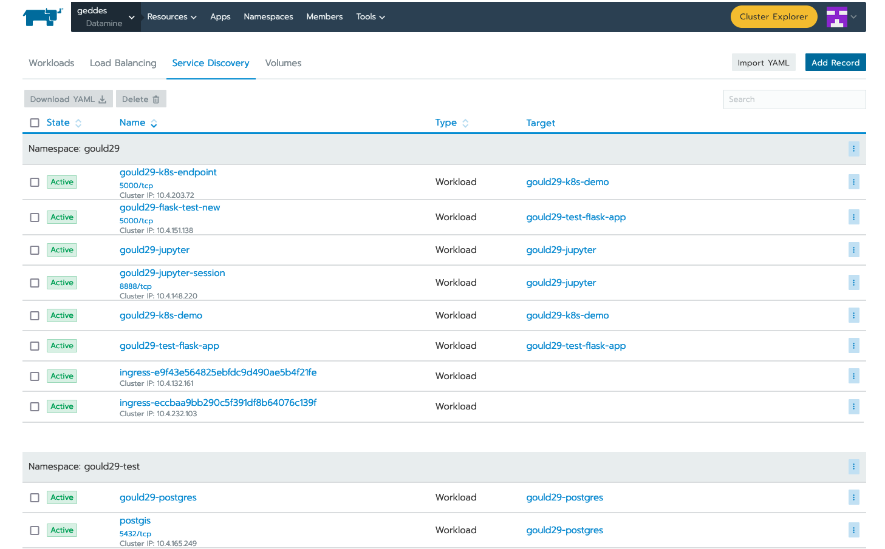

Success!

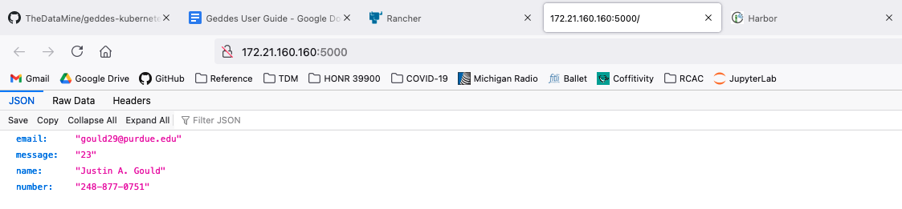

Now, to test the endpoint of our `add_two` microservice. For this test, we go back to the Jupyter Notebook:

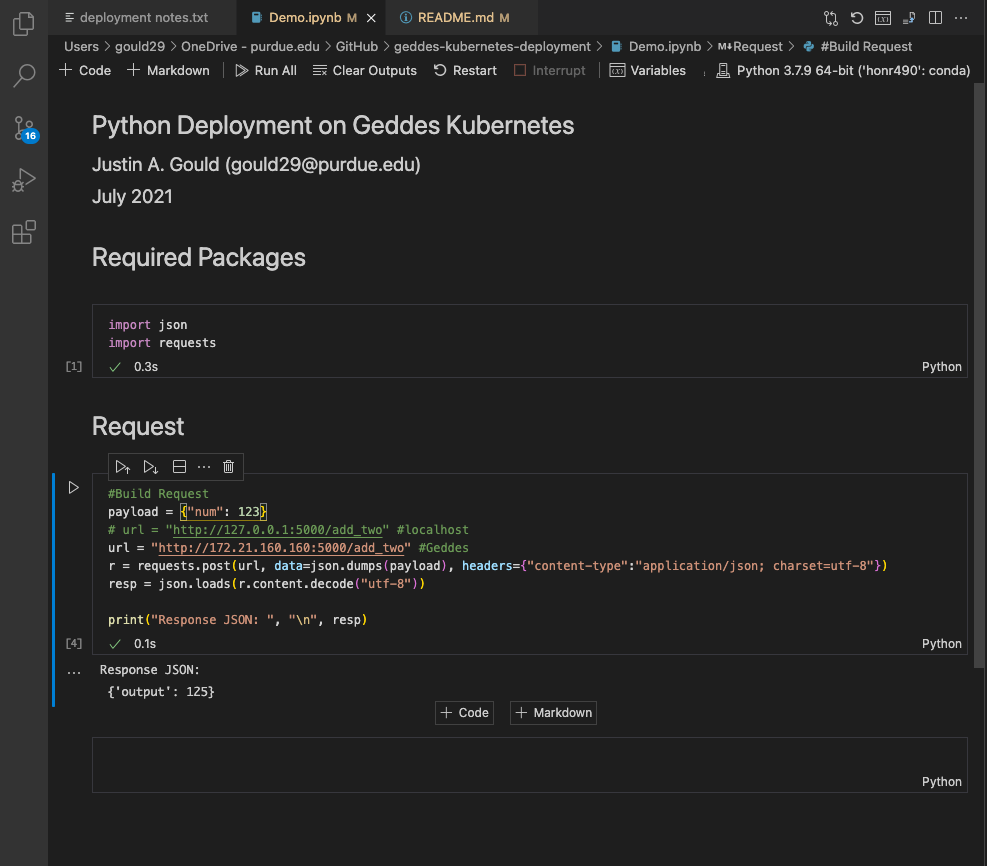

# Executing Code Outside of Dockerfile

While you can copy code from your local machine to the Docker image, as explained in the example contained within this repository, you will quickly find this is annoying. By referencing static code in your Dockerfile, every time code is updated, you need to re-build, tag, and push your Docker image to Registry.

One way to combat this is by utilizing the persistent storage volume space, **and remove any code copied to your Docker image.** What I do, instead, is use the Docker image to only set up the environment required to run the code I am deploying. For example, to run this repository's `app.py`, I change the Flask app to no longer copy and reference code from my local machine. Now my Dockerfile looks like this:

```bash
#Create a ubuntu base image with python 3 installed.
FROM python:3

#Set the working directory
WORKDIR /workspace

#copy all the files
# COPY . .                          NO LONGER NEEDED

#Install the dependencies
RUN apt-get -y update
RUN pip3 install flask

#Expose the required port
EXPOSE 5000

#Run the command
# CMD ["python3", "app.py"]         NO LONGER NEEDED
```

Note that I removed (commented out) 2 lines, one to copy files from current working directory to `/workspace` and the second to run the Flask application. Here is my rationale for this:

1. Remove `COPY . .`
    - I will make the code available on my persistent storage volume space, and no longer need to copy from my local machine. To do this, I will enable git on my personal storage volume and `clone` the repository--giving me the ability to edit, push, pull, etc. my code, and my K8s pod will always use the most up-to-date version.
2. Remove `CMD ["python3", "app.py"]`
    - I am using this Docker image to **only** set up my environment, not execute code. As you will see in the explanation below, I will reference this command in my `deployment.yaml` (i.e., Workloads page on Rancher). This allows me to recycle my Docker image and share it with peers.

Once you have made your Docker image use case-agnostic, re-build, tag, and push to the Harbor Registry. The example image I have for this is `geddes-registry.rcac.purdue.edu/gould29/gould29/flask_app:trial`.

## Enabling Git on Persistent Storage Volume

In order to do this, you need to have CLI access to a K8s pod referencing your persistent storage volume space. This can be done, for example, by running the following command in your terminal:

```bash
kubectl exec <CONTAINER> -it bash -n <NAMESPACE>
```

From there, you can authenticate Git via ssh key and clone your repositories. For a tutorial on how to do this step, please see https://stackoverflow.com/a/2643584.

Once your code is on your persistent storage volume space, it is time to deploy your workload, using the same steps outlined above for the first example. Everything is the same _except_ the actual `Workloads` yaml.

Create a new deployment:


This time, you will do the following:
  - Reference the correct image from Registry
  - Under `Volumes`, specify what is in the image below:
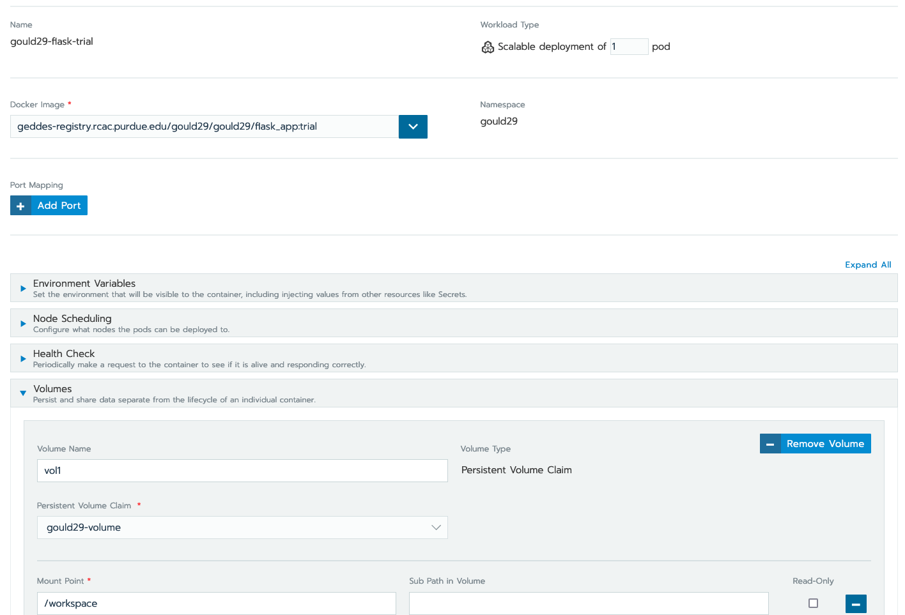
  - Then, select "Show advanced options" in the lower right
  - Type your `python3` command here, as it was in the Docker image, referencing the proper location of your code. In my case, my `app.py` is located in `/workspace/GitHub/geddes-kubernetes-deployment`, thus, my command is: `/workspace/GitHub/geddes-kubernetes-deployment/app.py`:
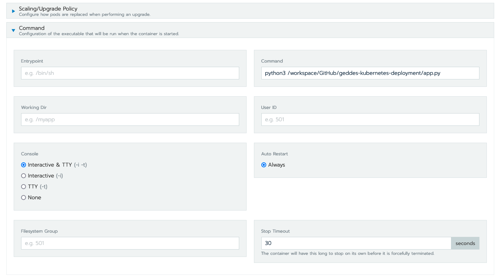

Hit "launch" and your application should deploy as the first example, where we copied and referenced a static build. Nice!

# Tips

I have an ongoing job on the Geddes K8s cluster which is a Jupyter Lab session, which has access to my persistent storage volume space, `gould29-storage`. So, when I want to develop any code I wish to deploy on the cluster, I do it here, typically under the project's respective GitHub repository. In other words, **I have Git enabled on my persistent storage volume space and interact with code and data via my Jupyter Lab Session**.

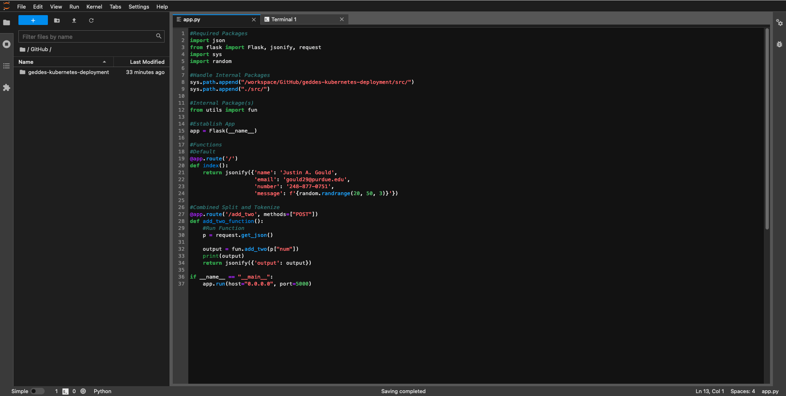

Then, when I am ready to deploy, I simply create a new "workload" on Rancher and reference the new code in the "Command" advanced option menu. This makes end-to-end work MUCH easier, and I love having instant access to HPC resources, via the JupyterLab session. _Just be sure not to re-create a storage volume every time you wish to use this; only reference an existing one, or your work will be wiped._

For reference, the Docker image I use for my _very_ trivial (and naked (really, there are almost no packages installed beyond base Python...!)) JupyterLab session is: `geddes-registry.rcac.purdue.edu/gould29/gould29/jupyter:latest`. The Dockerfile looks as such:

```bash
#Create a ubuntu base image with python 3 installed.
FROM python:3

#Set the working directory
WORKDIR /workspace

#Install the dependencies
RUN apt-get -y update
RUN pip3 install jupyterlab

#Expose the required port
EXPOSE 8888

#Specify volume
VOLUME [/workspace]

#Run the command
CMD ["jupyter", "lab", "--ip=0.0.0.0", "--allow-root", "--NotebookApp.base_url=/gould29/jupyter", "--port=8888"]
```

This means when I go to deploy, I head to `dns/gould29/jupyter` in my browser to access. This, again, requires access to VPN or an on-campus machine. A word to the wise, to see the logs/outputs of your K8s pod, run the following command:

```bash
kubectl logs <CONTAINER> -n <NAMESPACE>
```

This, for example, will show you the token you need for first-time access to your JupyterLab session.

# Closing Thoughts

Congratulations! You just deployed your first Flask application via Kubernetes!